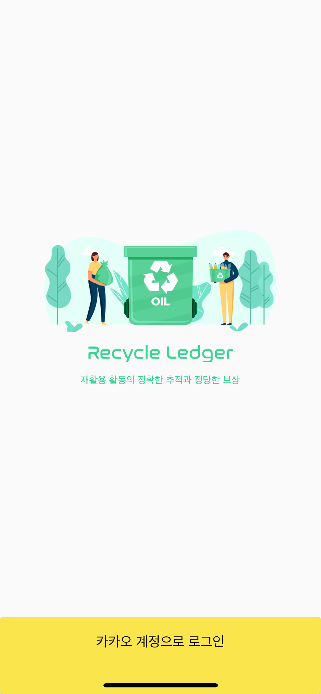

# 복붙

## Recycle

- 피그마 파일을 받아서 외주 작업으로 화면을 구현함.
    - 로그인, 사용자 종류(Restaurant, Collector, Buyer)에 따라 화면 작업.

### 모든 화면 공통 - Splash

    
### 로그인

  

   

### Restaurant

   

   

   

움직이는 애니메이션으로 구현

   

### Collector

  판매 화면도 현재는 동일하게 진행. 

qr 이미지를 클릭하면 우측 화면으로 이동.
판매 화면도 현재는 동일하게 진행.

  

### Buyer

    

qr 이미지 클릭 시 하단에서 페이지 올라오고 내려감.

